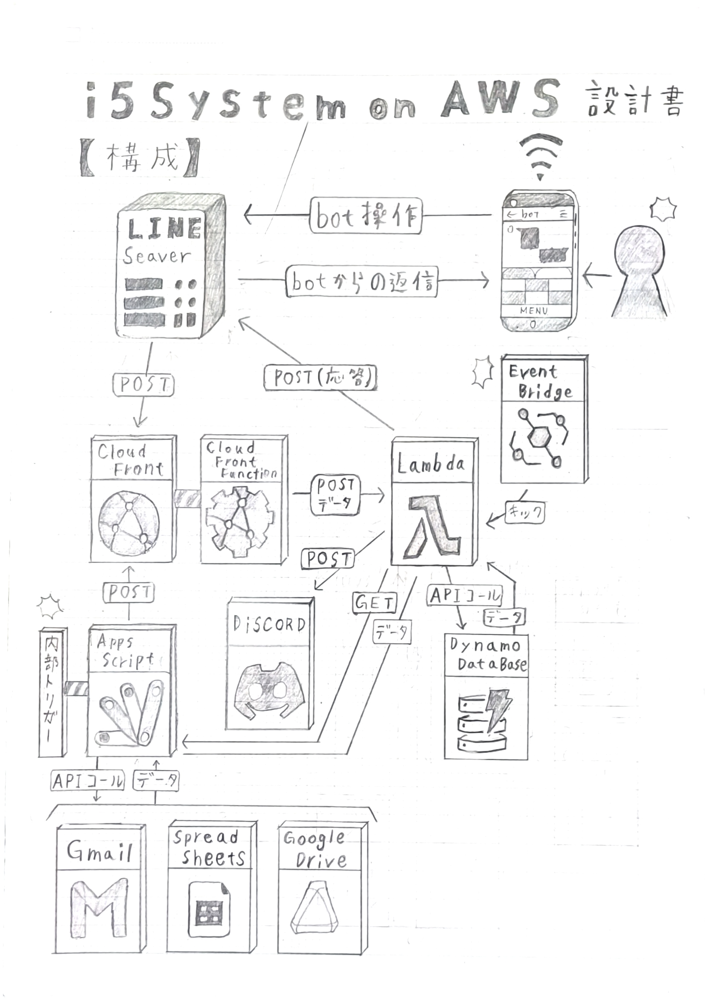
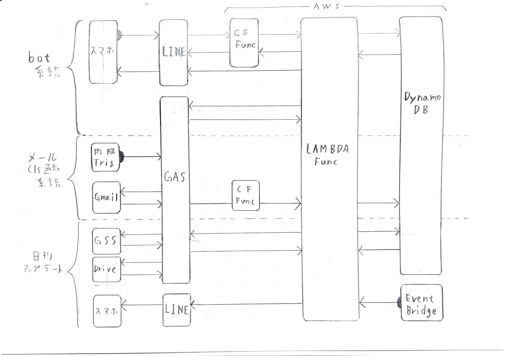

# i5system v4

## バージョンの概要
GASからAWSに移行したバージョン

## 解説
>  ###  Amazon Web Services
>> ###  AWS Lambda
>> バックエンドのメイン処理部。
>>> #### [i5system_lmf_main](i5system_lmf_main.js)
>>> LambdaFunction(メイン処理用)のコード。\
>>> HTTPリクエスト及びEventBridgeScheduler(毎日0時)により起動。
>>> #### 環境変数
>>> |キー|値|説明|
>>> |-|-|-|
>>>	|runLim_ctr|7500000|関数の実行上限(回/月)|
>>> |runLim_gbs|3000000|関数の実行上限(GB*S/月)|
>>> |conn_cfKey|-|"x-kick-by-cf"ヘッダーに指定した値|
>>> |conn_gasUrl|-|GASのURL|
>>> |conn_gasKey|-|lambda=>gas用のKey|
>>> |conn_lmfUrl|-|自身のURL|
>>> |conn_usrKey|-|usr=>lambda用のKey
>>> |lmf_main|i5system_lmf_main|Lambdaのメイン処理関数名|
>>> |lmf_reviver|i5system_lmf_reviver|Lambdaの再起動用関数名|
>>> |ddb_cache|i5system_ddb_cache|DynamoDBのキャッシュのテーブル名|
>>> |ddb_lineUsrs|i5system_ddb_lineUsrs|DynamoDBのLINEIDのテーブル名|
>>> |ddb_stNums|i5system_ddb_stNums|DynamoDBの出席番号のテーブル名|
>>> |disc_log_exe|-|実行ログ用のDiscordWebhook(固有部のみ)|
>>> |disc_log_run|-|稼動ログ用のDiscordWebhook(固有部のみ)|
>>> |disc_mails|-|個人のメルアドをキー、Webhookを値としたJSON|
>>> |lineToken|-|LINEbotのトークン|
>>> |imgurId|-|ImgurAPI用のID|
>>> |TZ|Asia/Tokyo|一部でJSTが必要になるため|
>>
>>> #### [i5system_lmf_reviver](i5system_lmf_reviver.js)
>>> LambdaFunction(スロットリング回復用)のコード。\
>>> 無料利用枠の超過によって自動で停止した[i5system_lmf_main](i5system_lmf_main.js)の解除と、消費リソースカウンターのリセットを行う。\
>>> 月末の24時前に起動するようにeventBridgeから設定。
>>>> ##### 環境変数
>>>> * lmf_main => [i5system_lmf_main](i5system_lmf_main.js)の関数名
>>>> * ddb_cache => cache用DynamoDBのテーブル名
>
>> ###  Amazon DynamoDB
>> インスタンス間で引き継ぐべきデータを保管
>> |テーブル名|格納対象|パーティションキー|キー|
>> |-|-|-|-|
>> |i5system_ddb_cache|一貫性のないもの|cacheKey|cacheVal|
>> |i5system_ddb_lineUsrs|Botユーザー|useId|色々(該当処理部を参照)|
>> |i5system_ddb_stNums|クラス通知|stNum|clsInfo|
>
>> ###  Amazon CloudFront
>>Lambdaへのアクセス制御を行う(無料利用枠の無いAPI GateWayの代替)\
>>LINEからのリクエストヘッダーがBodyのハッシュ値を含んでいないため、リクエストへの署名は行わない。\
>>代わりに"x-kick-by-cf"ヘッダーに事前に決めたランダム文字列を付加してLambdaにわたす。
>>> [i5system_cff_firewall](i5system_cff_firewall.js)\
>>> CloudFrontFunctions(ビューワーリクエスト)のコード。\
>>> クエリパラメータのsrcIdとsrcKeyの組み合わせによる簡易認証用。
>
>> ###  Amazon EventBridge
>> Lambdaの定期実行用。
>> |Cron式|対象関数|JSON|
>> |-|-|-|
>> |0,0,\*,\*,?,*|i5system_lmf_main|{ "src":"EventBridge", "tgt":"daily" }|
>> |55,23,L,\*,?,*|i5system_lmf_reviver|-|
>> |57,23,L,3,?,2027|i5system_lmf_main|{ "src":"EventBridge", "tgt":"kill" }|

>  ###  Google Cloud Platform
>> ###  Google Apps Scrips
>> GCP系の操作用。
>>> #### [i5system_gas_boot](i5system_gas_boot.js)
>>> コードを変更するたびにデプロイするのが面倒なため起動部だけ分離。\
>>> GETリクエスト及び10分おきのトリガーで起動し、[i5system_gas_exec](i5system_gas_exec.js)に渡す。
>>
>>> #### [i5system_gas_exec](i5system_gas_exec.js)
>>> GCP系サービスの操作用\
>>> トリガー → 受信したメールをLambdaに送信\
>>> GETリクエスト → クエリパラメータに応じて[i5system_gss_db](i5system_gss_db)やGmailを操作
>>
>>> #### [i5system_gas_rmUpdate](i5system_gas_rmUpdate.js)
>>> 初回起動時用\
>>> リッチメニュー用画像(GoogleDrive上にあるもの)のID等を指定してすることでLINEのリッチメニューを更新できる
>>> [RM_A.png](RM_A.png) と [RM_B.png](RM_B.png) を使用
>  
>> ###  Google Spread Sheet
>> ユーザーが編集する必要のある情報の保存先
>>> #### [i5system_gss_db](i5system_gss_db)

>> ###  LINE Messaging API
>> フロントエンドのメインであるbot

>> ###  Discord
>> 実行ログ出力用(エラー報告&消費リソースの定期報告)

>> ###  imgur
>> カフェテリアのメニューの保存先

## システムのイメージ図(※一部不正確)
\
